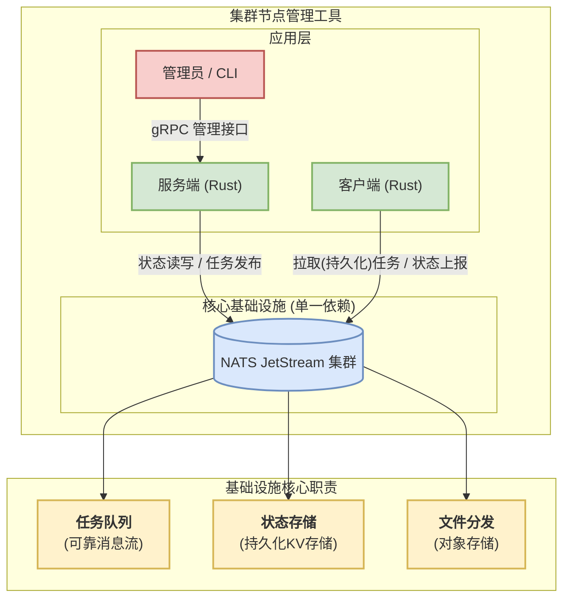

# Oasis

[](https://www.rust-lang.org)

Oasis 是一个大规模集群节点管理工具，支持 Linux 操作系统。提供统一的命令行界面来管理大规模节点。支持任务执行、文件分发、灰度发布等核心功能。

## ✨ 特性

- 🚀 **统一管理**: 通过单一 CLI 工具管理整个集群
- 🎯 **智能选择器**: 基于标签、系统信息和分组的灵活节点选择
- 📦 **文件分发**: 支持版本化文件管理和部署，原子性替换保证安全，支持回滚和版本清理
- 🔄 **灰度发布**: 支持百分比、计数策略的渐进式发布
- ⚡ **实时监控**: 任务执行状态实时反馈和超时控制
- 🔒 **安全可靠**: 基于 mTLS 的安全通信，支持首次证书引导、自动续签和连接内重连
- 🐳 **容器化**: 支持 Docker Compose 快速部署

## 🚀 快速开始

### 1. 构建项目

```bash
git clone https://github.com/CHAK-MING/oasis
cd oasis
cargo build --release
```

### 2. 初始化系统

```bash
# 生成证书、配置文件和 docker-compose.yml
./target/release/oasis-cli system init
```

### 3. 启动 NATS

```bash
# 启动 NATS 消息队列
docker compose up -d
```

> 提示：启动后可在浏览器访问 `http://localhost:8222/` 查看 NATS 监控页面（若在远程主机或容器环境，请将 `localhost` 替换为对应主机 IP）。常用端点：`/varz`（服务概览）、`/connz`（连接）、`/routez`（路由）、`/jsz`（JetStream）。

### 4. 安装并启动服务器

```bash
# 安装为 systemd 服务
sudo ./target/release/oasis-cli system install

# 启动服务器
sudo ./target/release/oasis-cli system start

# 查看状态
sudo ./target/release/oasis-cli system status
```

### 5. 部署 Agent

```bash
# 部署 Agent 到远程主机
./target/release/oasis-cli agent deploy \
  --ssh-target user@remote-host \
  --agent-id agent123456 \
  --nats-url tls://YOUR_SERVER_IP:4222 \
  --output-dir ~/agent-deploy \
  --labels "env=prod" \
  --labels "role=web" \
  --groups "web" \
  --agent-binary ./target/release/oasis-agent

# 在远程主机上安装
cd ~/agent-deploy/agent123456/
sudo ./install.sh

# 查看 Agent 状态
sudo systemctl status oasis-agent
```

> **注意**：部署包默认包含 `certs/nats-ca.pem`，用于 Agent 首次通过 TLS 向 CA 发起 CSR 请求。首次启动时 Agent 会优先使用 `OASIS_BOOTSTRAP_TOKEN` 申请客户端证书；如果 token 已失效，也可以通过环境变量 `OASIS_ENROLLMENT_SECRET` 或 `certs/enrollment-secret` 文件完成补发式入网。证书拿到后，Agent 会在到期前自动续签，并在进程内重建 NATS 连接，无需依赖 supervisor 重启。

### 6. 验证部署

```bash
# 查看所有 Agent
./target/release/oasis-cli agent list -t 'all'

# 执行测试命令
./target/release/oasis-cli exec run -t 'all' -- /bin/echo "Hello Oasis"

# 查看任务结果
./target/release/oasis-cli exec get <batch_id>
```

## 📖 使用指南

### 系统管理 (`system`)

```bash
# 初始化系统（生成证书和配置）
oasis-cli system init --force

# 安装服务器为 systemd 服务
oasis-cli system install

# 启动/停止/重启服务器
oasis-cli system start
oasis-cli system stop
oasis-cli system restart

# 查看服务器状态
oasis-cli system status

# 查看服务器日志
oasis-cli system logs --lines 150 --follow

# 卸载服务器
oasis-cli system uninstall
```

### 任务执行 (`exec`)

```bash
# 提交任务到指定节点
oasis-cli exec run -t 'labels["role"] == "web"' -- /usr/bin/uptime

# 使用系统信息选择节点
oasis-cli exec run -t 'system["hostname"] == "server01"' -- /usr/bin/ps aux

# 选择所有在线节点
oasis-cli exec run -t 'all' -- /bin/echo "Hello World"

# 设置超时时间（秒）
oasis-cli exec run -t 'all' --timeout 30 -- sleep 60

# 查看任务结果
oasis-cli exec get <batch_id>

# 列出最近的任务
oasis-cli exec list --limit 20

# 取消任务
oasis-cli exec cancel <batch_id>
```

### 文件分发 (`file`)

```bash
# 分发配置文件
oasis-cli file apply \
  --src ./nginx.conf \
  --dest /etc/nginx/nginx.conf \
  --target 'labels["role"] == "web"'

# 设置文件权限和所有者
oasis-cli file apply \
  --src ./app.conf \
  --dest /etc/myapp/config.conf \
  --target 'labels["environment"] == "prod"' \
  --owner root:root \
  --mode 0644

# 指定多个 Agent ID
oasis-cli file apply \
  --src ./config.conf \
  --dest /etc/config.conf \
  --target 'agent-1,agent-2,agent-3'

# 查看文件历史版本
oasis-cli file history --source-path ./nginx.conf

# 回滚到指定版本
oasis-cli file rollback \
  --source-path ./nginx.conf \
  --revision 1 \
  --dest /etc/nginx/nginx.conf \
  --target 'labels["role"] == "web"'

# 清理旧版本文件（保留最近 10 个版本和 30 天内的版本）
oasis-cli file gc --keep-versions 10 --keep-days 30

# 清理指定文件的旧版本
oasis-cli file gc --source-path ./nginx.conf --keep-versions 5 --keep-days 7

# 清空文件仓库，清空完后所有文件的历史记录将不存在（危险操作）
oasis-cli file clear
```

### Agent 管理 (`agent`)

```bash
# 部署 Agent 到远程主机
oasis-cli agent deploy \
  --ssh-target user@host \
  --agent-id agent-1234567890 \
  --nats-url tls://127.0.0.1:4222 \
  --output-dir ./agent-deploy \
  --labels "env=test" \
  --labels "role=worker" \
  --groups "test-group" \
  --agent-binary ./oasis-agent \
  --auto-install

# 列出所有 Agent
oasis-cli agent list

# 列出详细信息和系统信息
oasis-cli agent list --verbose

# 按条件筛选 Agent
oasis-cli agent list -t 'labels["environment"] == "prod"' --verbose

# 移除 Agent
oasis-cli agent remove \
  --ssh-target user@host \
  --agent-id agent-1234567890

# 设置 Agent 标签和分组
oasis-cli agent set \
  --agent-id agent-1234567890 \
  --labels "env=prod" \
  --labels "version=v2.0" \
  --groups "production"
```

### 灰度发布 (`rollout`)

```bash
# 创建命令灰度发布
oasis-cli rollout create \
  --name "系统更新" \
  --target 'labels["role"] == "web"' \
  --strategy percentage:10,30,60,100 \
  --command "dnf upgrade" \
  --args "-y" \
  --timeout 300

# 创建文件灰度发布
oasis-cli rollout create \
  --name "配置更新" \
  --target 'labels["environment"] == "prod"' \
  --strategy count:2,5,10,0 \
  --file-src ./nginx.conf \
  --file-dest /etc/nginx/nginx.conf \
  --file-mode 0644

# 自动推进的灰度发布
oasis-cli rollout create \
  --name "自动发布" \
  --target 'labels["role"] == "api"' \
  --strategy percentage:25,50,100 \
  --command "systemctl restart myapp" \
  --auto-advance \
  --advance-interval 300

# 带阶段超时、失败率门禁和自动回滚的命令发布
oasis-cli rollout create \
  --name "nginx reload" \
  --target '"canary" in groups' \
  --strategy count:1,0 \
  --command "systemctl reload nginx" \
  --stage-timeout 120 \
  --max-failure-rate 0 \
  --auto-rollback \
  --rollback-command "systemctl restart nginx"

# 查看发布状态
oasis-cli rollout status rollout-12345678

# 手动推进到下一阶段
oasis-cli rollout advance rollout-12345678

# 暂停 / 恢复发布
oasis-cli rollout pause rollout-12345678
oasis-cli rollout resume rollout-12345678

# 列出所有发布
oasis-cli rollout list --limit 10

# 回滚发布
oasis-cli rollout rollback rollout-12345678 --rollback-command "systemctl restart nginx"
```

## 🎯 选择器语法

Oasis 使用强大的选择器语法来精确选择目标节点：

### 基础选择器

```bash
# 选择所有节点
all
true

# 选择指定 Agent ID
agent-1,agent-2,agent-3

# 基于标签选择
labels["environment"] == "production"
labels["role"] == "web"
labels["version"] == "1.0"

# 基于系统信息选择
system["hostname"] == "server01"
system["os_name"] == "linux"
system["cpu_cores"] == "8"
system["memory_total_gb"] == "16"

# 基于分组选择
"production" in groups
"web-servers" in groups
```

### 逻辑运算

```bash
# 与运算
labels["env"] == "prod" and system["os_name"] == "linux"

# 或运算
labels["team"] == "backend" or labels["team"] == "frontend"

# 非运算
not labels["maintenance"] == "true"

# 复杂表达式
(labels["env"] == "prod" or labels["env"] == "staging") and system["cpu_cores"] == "8"
not (labels["deprecated"] == "true" or system["os_name"] == "windows")
```

### 灰度策略

```bash
# 百分比策略：10% -> 30% -> 60% -> 100%
percentage:10,30,60,100

# 计数策略：2台 -> 5台 -> 10台 -> 全部
count:2,5,10,0
```

### 灰度控制能力

```bash
# 阶段超时（秒）：超时后阶段直接判失败
--stage-timeout 300

# 阶段允许的最大失败率（百分比）
--max-failure-rate 10

# 自动推进
--auto-advance --advance-interval 300

# 自动回滚（命令发布需同时提供 rollback-command）
--auto-rollback --rollback-command "systemctl restart myapp"
```

## 📊 系统信息标签

Agent 自动收集以下系统信息，可用于选择器：

| 系统信息 | 标签名            | 示例值            |
| -------- | ----------------- | ----------------- |
| 主机名   | `hostname`        | `web-server-01`   |
| 主 IP    | `primary_ip`      | `192.168.1.100`   |
| CPU 架构 | `cpu_arch`        | `x86_64`          |
| CPU 核数 | `cpu_cores`       | `8`               |
| 内存大小 | `memory_total_gb` | `16`              |
| 操作系统 | `os_name`         | `linux`           |
| OS 版本  | `os_version`      | `OpenCloudOS 9`   |
| 内核版本 | `kernel_version`  | `5.14.0-284.11.1` |

## 🏗️ 架构


```mermaid
graph TD
    %% 定义不同组件的样式
    classDef server fill:#D5E8D4,stroke:#82B366,stroke-width:2px;
    classDef agent fill:#D5E8D4,stroke:#82B366,stroke-width:2px;
    classDef infra fill:#DAE8FC,stroke:#6C8EBF,stroke-width:2px;
    classDef responsibility fill:#FFF2CC,stroke:#D6B656,stroke-width:2px;
    classDef admin fill:#F8CECC,stroke:#B85450,stroke-width:2px;

    subgraph "集群节点管理工具"
        direction LR
        subgraph "应用层"
            Admin["管理员 / CLI"]:::admin
            Server["服务端 (Rust)"]:::server
            Agent["客户端 (Rust)"]:::agent
        end

        subgraph "核心基础设施 (单一依赖)"
            JetStream[("NATS JetStream 集群")]:::infra
        end

        Admin -- "gRPC 管理接口" --> Server
        Server -- "状态读写 / 任务发布" --> JetStream
        Agent -- "拉取(持久化)任务 / 状态上报" --> JetStream
    end

    subgraph "基础设施核心职责"
        direction TB
        TaskQueue["<b>任务队列</b><br/>(可靠消息流)"]:::responsibility
        StateStore["<b>状态存储</b><br/>(持久化KV存储)"]:::responsibility
        FileStore["<b>文件分发</b><br/>(对象存储)"]:::responsibility
    end

    JetStream --> TaskQueue
    JetStream --> StateStore
    JetStream --> FileStore
```

## 🔧 配置

### 服务器配置 (`oasis.toml`)

```toml
[server]
# 服务器监听地址
listen_addr = "0.0.0.0:50051"
# TTL 心跳，用来维持与 Agent 的连接
heartbeat_ttl_sec = 60

[grpc]
# CLI与服务器的grpc连接
url = "https://localhost:50051"

[nats]
# nats 地址
url = "tls://127.0.0.1:4222"

[tls]
# TLS证书目录
certs_dir = "./certs"
# 证书到期前多少天开始续签
renew_before_days = 30
# 后台检查续签的间隔（秒）
renew_check_interval_sec = 21600

[telemetry]
# 遥测日志配置
log_level = "info"
log_format = "json"
log_no_ansi = false
```

### Agent 环境变量

```bash
# Agent 连接配置
OASIS__NATS__URL=tls://127.0.0.1:4222
OASIS__TLS__CERTS_DIR=/opt/oasis/certs
OASIS__TLS__RENEW_BEFORE_DAYS=30
OASIS__TLS__RENEW_CHECK_INTERVAL_SEC=21600

# 首次启动证书引导（仅首次需要，成功后建议移除）
OASIS_BOOTSTRAP_TOKEN=your-bootstrap-token

# 当 bootstrap token 过期后，可选的补发式入网凭据
# 也可以写入 /opt/oasis/certs/enrollment-secret 文件
OASIS_ENROLLMENT_SECRET=your-enrollment-secret

# Agent 标识
OASIS__AGENT_ID=agent123456
OASIS__AGENT_LABELS=env=prod,role=web
OASIS__AGENT_GROUPS=production,web-servers

# 心跳配置
OASIS__AGENT__HEARTBEAT_INTERVAL_SEC=30
OASIS__AGENT__FACT_COLLECTION_INTERVAL_SEC=300
```

## 🚀 部署

### Docker Compose 部署

```yaml
version: "3.8"
services:
  nats:
    image: nats:2.10-alpine
    ports:
      - "4222:4222"
      - "8222:8222"
    command:
      - "--tls"
      - "--tlscert=/certs/nats-server.pem"
      - "--tlskey=/certs/nats-server-key.pem"
      - "--tlsca=/certs/nats-ca.pem"
      - "--jetstream"
    volumes:
      - ./certs:/certs
      - ./data/nats:/data
```
