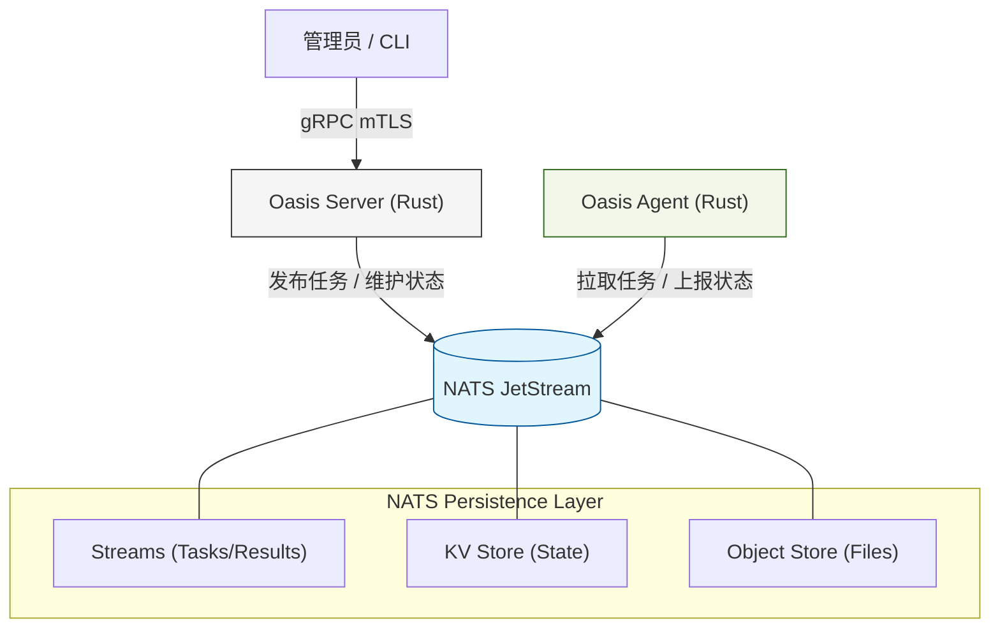

> [!NOTE]
> **Oasis 正在积极开发中。**

# Oasis

[](https://www.rust-lang.org) [](LICENSE) [](https://deepwiki.com/CHAK-MING/oasis)

## 🧐 什么是 Oasis？

Oasis 是一个专为大规模 Linux 节点设计的统一管控系统，主要解决**远程任务下发**、**配置分发**与**灰度发布**等场景中的效率与可靠性问题。

项目采用了 **Server-Agent 全异步架构**。Oasis 选择了基于 **NATS JetStream** 的消息总线控制面，使 Agent 能够以“拉取”方式消费任务。

### 🌟 核心设计

| 维度 | 说明 |
|:--|:--|
| 🏗️ **异步调度** | 采用消息队列解耦任务下发与执行，支持 Agent 离线任务恢复。 |
| 🛡️ **安全链路** | 基于 mTLS 实现双向认证，支持证书的自动化引导与周期性续签。 |
| 📊 **过程受控** | 灰度发布支持按阶段推进，内置失败率门禁与自动回滚逻辑。 |
| 📦 **原子化更新** | 文件协议支持分块传输与原子化替换，确保目标文件状态的一致性。 |
| 🎯 **声明式筛选** | 内置基于标签、分组、系统信息与 Agent ID 的节点选择引擎，支持逻辑表达式组合。 |

---

## 🛠️ 核心能力

### 1. 任务执行 (`exec`)

支持显式 ACK 机制与有限重试。任务结果支持持久化存储，可通过 CLI 或 API 进行异步聚合查询。

### 2. 文件分发 (`file`)

基于版本化的文件管理协议。支持细粒度的权限控制 (`owner/mode`)、历史版本存证以及基于生命周期的自动清理 (GC)。

### 3. 灰度发布 (`rollout`)

提供标准的状态机驱动发布流程，支持文件发布与命令发布两种类型，具备阶段超时保护与故障自动回滚能力。

### 4. 实时事件流 (`events`)

统一发布 Agent 状态、任务终态、文件应用结果与灰度阶段事件，支持通过 CLI 进行实时流式观测。

---

## 📈 性能概览

下面是最近一次真实环境下的基准结果摘要，详细图表和明细见 [benchmark.md](./docs/benchmark.md)。


| 场景 | 结果 | 说明 |
|:--|:--|:--|
| `nats_io/request_reply` | `152.32-158.87 µs` | 真实 NATS TLS 请求-响应 |
| `e2e_latency/roundtrip` | `146.48-151.67 µs` | Server → NATS → Agent → NATS → Server |
| `e2e_latency/broadcast_to_agents/1000` | `8.0171-9.9480 ms` | 千节点广播链路 |
| `throughput/sustained` | `186,930 tasks/sec` | 持续 10 秒真实吞吐 |
| `fanout/map_to_proto/10000` | `1.8281 ms` | 扇出结果映射 |

---

## 🚀 快速开始

### 1. 构建项目

```bash
git clone https://github.com/CHAK-MING/oasis
cd oasis
cargo build --release
```

### 2. 系统初始化

```bash
# 生成 CA 证书及基础配置文件
./target/release/oasis-cli system init
```

### 3. 启动基础设施

```bash
# 基于 Docker 快速拉起具备持久化能力的 NATS
docker compose up -d
```

### 4. 安装并运行服务端

```bash
# 将服务端注册为 systemd 服务
sudo ./target/release/oasis-cli system install
sudo ./target/release/oasis-cli system start
```

---

## 🏗️ 架构设计

Oasis 致力于保持基础设施的简洁性，将 NATS JetStream 作为核心依赖，统一承载消息流、状态 KV 与对象存储。


```mermaid
graph TD
    classDef server fill:#f5f5f5,stroke:#333,stroke-width:1px;
    classDef infra fill:#e1f5fe,stroke:#01579b,stroke-width:1px;
    classDef agent fill:#f1f8e9,stroke:#33691e,stroke-width:1px;

    Admin["管理员 / CLI"] -->|gRPC mTLS| Server["Oasis Server (Rust)"]:::server
    Server -->|发布任务 / 维护状态| NATS[("NATS JetStream")]:::infra
    Agent["Oasis Agent (Rust)"]:::agent -->|拉取任务 / 上报状态| NATS

    subgraph "NATS Persistence Layer"
        Queue["Streams (Tasks/Results)"]
        KV["KV Store (State)"]
        Obj["Object Store (Files)"]
    end
    NATS --- Queue
    NATS --- KV
    NATS --- Obj
```

---

## 🧭 文档导航

> 提示：部分文档仍在持续完善中，如有疑问请通过 Issue 反馈。

- [**Benchmark**](./docs/benchmark.md) —— **最新 bench 图表与明细数据**
- [**DeepWiki 知识库**](https://deepwiki.com/CHAK-MING/oasis) —— **核心功能参考与最佳实践**

---

## 🤝 贡献与反馈

Oasis 仍处于活跃开发阶段，欢迎通过以下方式参与：

*   **提交 Issue**：反馈 Bug 或提出功能建议。
*   **提交 PR**：贡献代码前，请确保已通过本地单元测试。
*   **License**: [Apache License 2.0](LICENSE)
*   **Maintainer**: [CHAK-MING](https://github.com/CHAK-MING)
