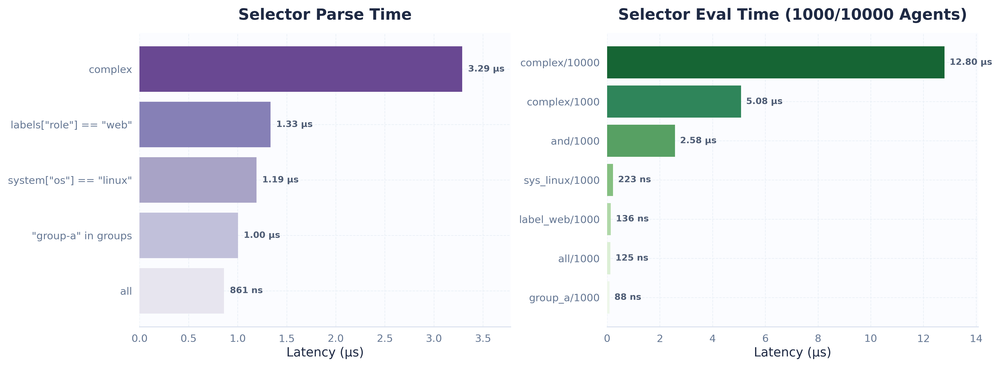
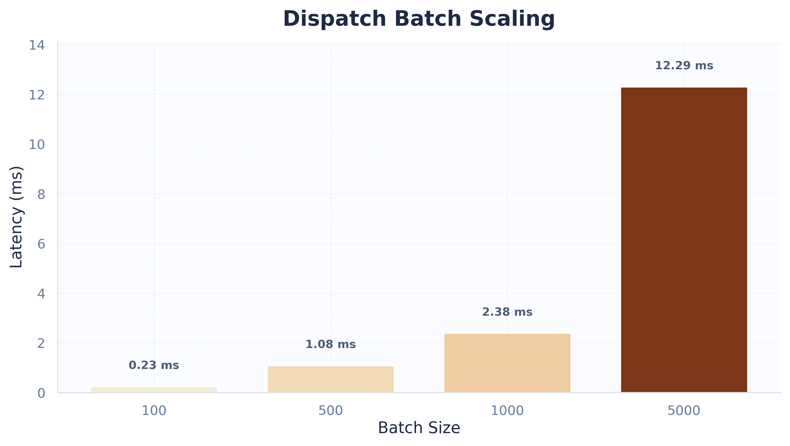

# 📊 Oasis Benchmark

> [!NOTE]
> **这份文档记录了 Oasis 在最近一次真实 NATS 环境与纯内存路径下的基准测试结果。**
> **测试覆盖**：控制面单跳延迟、广播扇出、CPU 热路径以及持续吞吐量。

## 🎯 结论速览

Oasis 的当前性能画像非常稳定，能够轻松应对高并发管控场景：

- ⚡ **超低延迟**：真实 NATS TLS 请求-响应保持在 `150 µs` 左右。端到端 roundtrip 也保持在 `150 µs`，P99.9 低于 `0.5 ms`。
- 🚀 **高效扇出**：1000 个 Agent 的广播调度窗口仅需 `8-10 ms`，延迟增长与节点规模保持线性健康比例。
- 🌊 **高吞吐量**：在持续 10 秒的压力测试下，稳定吞吐达到 `186,930 tasks/sec`。
- 🔍 **优化方向**：目前 CPU 侧的性能热点主要集中在 `fanout/map_to_proto`（结果映射），而不是状态聚合本身。

---

## 总览

<table align="center">
  <thead>
    <tr>
      <th>场景</th>
      <th>结果</th>
      <th>说明</th>
    </tr>
  </thead>
  <tbody>
    <tr>
      <td><code>nats_io/request_reply</code></td>
      <td><code>152.32-158.87 µs</code></td>
      <td>真实 NATS TLS 请求-响应</td>
    </tr>
    <tr>
      <td><code>e2e_latency/roundtrip</code></td>
      <td><code>146.48-151.67 µs</code></td>
      <td>Server → NATS → Agent → NATS → Server</td>
    </tr>
    <tr>
      <td><code>e2e_latency/broadcast_to_agents/1000</code></td>
      <td><code>8.0171-9.9480 ms</code></td>
      <td>千节点广播链路</td>
    </tr>
    <tr>
      <td><code>throughput/sustained</code></td>
      <td><code>186,930 tasks/sec</code></td>
      <td>持续 10 秒真实吞吐</td>
    </tr>
    <tr>
      <td><code>fanout/map_to_proto/10000</code></td>
      <td><code>1.8281 ms</code></td>
      <td>扇出结果映射</td>
    </tr>
  </tbody>
</table>

---

## 关键链路

<p align="center">
  
</p>

<table align="center">
  <thead>
    <tr>
      <th>场景</th>
      <th>结果</th>
      <th>说明</th>
    </tr>
  </thead>
  <tbody>
    <tr><td><code>nats_io/request_reply</code></td><td><code>152.32-158.87 µs</code></td><td>单次消息往返</td></tr>
    <tr><td><code>nats_io/jetstream_kv_put_get</code></td><td><code>234.50-246.13 µs</code></td><td>JetStream KV 读写</td></tr>
    <tr><td><code>e2e_latency/dispatch_only</code></td><td><code>18.814-18.990 µs</code></td><td>纯派发开销</td></tr>
    <tr><td><code>e2e_latency/roundtrip</code></td><td><code>146.48-151.67 µs</code></td><td>完整控制链路</td></tr>
    <tr><td><code>e2e_latency/broadcast_to_agents/10</code></td><td><code>228.54-235.11 µs</code></td><td>10 个 Agent 广播</td></tr>
    <tr><td><code>e2e_latency/broadcast_to_agents/100</code></td><td><code>927.10-957.14 µs</code></td><td>100 个 Agent 广播</td></tr>
    <tr><td><code>e2e_latency/broadcast_to_agents/500</code></td><td><code>3.5841-3.6978 ms</code></td><td>500 个 Agent 广播</td></tr>
    <tr><td><code>e2e_latency/broadcast_to_agents/1000</code></td><td><code>8.0171-9.9480 ms</code></td><td>1000 个 Agent 广播</td></tr>
  </tbody>
</table>

<p align="center">
  
</p>

---

## CPU 热路径

### 纯内存 / 序列化路径

<p align="center">
  
</p>

<table align="center">
  <thead>
    <tr>
      <th>场景</th>
      <th>结果</th>
      <th>说明</th>
    </tr>
  </thead>
  <tbody>
    <tr><td><code>proto/submit_batch</code> encode</td><td><code>98.5 ns</code></td><td>批量任务请求编码</td></tr>
    <tr><td><code>proto/submit_batch</code> decode</td><td><code>287.8 ns</code></td><td>批量任务请求解码</td></tr>
    <tr><td><code>proto/agent_info</code> encode</td><td><code>206.4 ns</code></td><td>Agent 元数据编码</td></tr>
    <tr><td><code>proto/agent_info</code> decode</td><td><code>882.3 ns</code></td><td>Agent 元数据解码</td></tr>
    <tr><td><code>proto/file_spec</code> encode</td><td><code>54.8 ns</code></td><td>文件规格编码</td></tr>
    <tr><td><code>proto/file_spec</code> decode</td><td><code>172.1 ns</code></td><td>文件规格解码</td></tr>
    <tr><td><code>proto/file_chunk64k</code> encode</td><td><code>2.100 µs</code></td><td>64 KiB 分块编码</td></tr>
    <tr><td><code>proto/file_chunk64k</code> decode</td><td><code>4.182 µs</code></td><td>64 KiB 分块解码</td></tr>
    <tr><td><code>proto/file_apply</code> encode</td><td><code>104.1 ns</code></td><td>文件应用请求编码</td></tr>
    <tr><td><code>proto/file_apply</code> decode</td><td><code>312.9 ns</code></td><td>文件应用请求解码</td></tr>
  </tbody>
</table>

### Fanout 与聚合

<table align="center">
  <thead>
    <tr>
      <th>场景</th>
      <th>结果</th>
      <th>说明</th>
    </tr>
  </thead>
  <tbody>
    <tr><td><code>fanout/aggregate/100</code></td><td><code>160.46 ns</code></td><td>100 条结果聚合</td></tr>
    <tr><td><code>fanout/aggregate/1000</code></td><td><code>1.4818 µs</code></td><td>1000 条结果聚合</td></tr>
    <tr><td><code>fanout/aggregate/5000</code></td><td><code>7.3803 µs</code></td><td>5000 条结果聚合</td></tr>
    <tr><td><code>fanout/aggregate/10000</code></td><td><code>15.934 µs</code></td><td>10000 条结果聚合</td></tr>
    <tr><td><code>fanout/map_to_proto/100</code></td><td><code>17.683 µs</code></td><td>100 条结果映射</td></tr>
    <tr><td><code>fanout/map_to_proto/1000</code></td><td><code>178.19 µs</code></td><td>1000 条结果映射</td></tr>
    <tr><td><code>fanout/map_to_proto/5000</code></td><td><code>903.46 µs</code></td><td>5000 条结果映射</td></tr>
    <tr><td><code>fanout/map_to_proto/10000</code></td><td><code>1.8281 ms</code></td><td>10000 条结果映射</td></tr>
  </tbody>
</table>

### Selector 解析与求值

<p align="center">
  
</p>

<table align="center">
  <thead>
    <tr>
      <th>场景</th>
      <th>结果</th>
      <th>说明</th>
    </tr>
  </thead>
  <tbody>
    <tr><td><code>selector/parse/all</code></td><td><code>860.9 ns</code></td><td>空表达式解析</td></tr>
    <tr><td><code>selector/parse/labels["role"] == "web"</code></td><td><code>1.335 µs</code></td><td>单条件解析</td></tr>
    <tr><td><code>selector/parse/system["os"] == "linux"</code></td><td><code>1.192 µs</code></td><td>系统字段解析</td></tr>
    <tr><td><code>selector/parse/"group-a" in groups</code></td><td><code>1.003 µs</code></td><td>分组表达式解析</td></tr>
    <tr><td><code>selector/parse/complex</code></td><td><code>3.289 µs</code></td><td>复合表达式解析</td></tr>
    <tr><td><code>selector/eval/all/1000</code></td><td><code>124.8 ns</code></td><td>1000 Agent 下全量匹配</td></tr>
    <tr><td><code>selector/eval/label_web/1000</code></td><td><code>135.7 ns</code></td><td>1000 Agent 下标签匹配</td></tr>
    <tr><td><code>selector/eval/sys_linux/1000</code></td><td><code>223.0 ns</code></td><td>1000 Agent 下系统字段匹配</td></tr>
    <tr><td><code>selector/eval/group_a/1000</code></td><td><code>88.45 ns</code></td><td>1000 Agent 下分组匹配</td></tr>
    <tr><td><code>selector/eval/and/1000</code></td><td><code>2.576 µs</code></td><td>1000 Agent 下 AND 求值</td></tr>
    <tr><td><code>selector/eval/complex/1000</code></td><td><code>5.08 µs</code></td><td>1000 Agent 下复杂求值</td></tr>
    <tr><td><code>selector/eval/complex/10000</code></td><td><code>12.80 µs</code></td><td>10000 Agent 下复杂求值</td></tr>
  </tbody>
</table>

---

## 真实 NATS I/O 与吞吐

<p align="center">
  
</p>

<table align="center">
  <thead>
    <tr>
      <th>场景</th>
      <th>结果</th>
      <th>说明</th>
    </tr>
  </thead>
  <tbody>
    <tr><td><code>nats_io/request_reply</code></td><td><code>152.32-158.87 µs</code></td><td>真实 NATS TLS 请求-响应</td></tr>
    <tr><td><code>nats_io/jetstream_kv_put_get</code></td><td><code>234.50-246.13 µs</code></td><td>真实 JetStream KV 读写</td></tr>
    <tr><td><code>throughput/dispatch_batch/100</code></td><td><code>225.49-240.26 µs</code></td><td>100 条任务批量下发</td></tr>
    <tr><td><code>throughput/dispatch_batch/500</code></td><td><code>1.0367-1.1195 ms</code></td><td>500 条任务批量下发</td></tr>
    <tr><td><code>throughput/dispatch_batch/1000</code></td><td><code>2.1107-2.6535 ms</code></td><td>1000 条任务批量下发</td></tr>
    <tr><td><code>throughput/dispatch_batch/5000</code></td><td><code>11.702-12.881 ms</code></td><td>5000 条任务批量下发</td></tr>
    <tr><td><code>throughput/sustained</code></td><td><code>186,930 tasks/sec</code></td><td>10 秒持续发送/接收</td></tr>
  </tbody>
</table>

---

## 测量方法

所有数据都来自 `criterion` 基准测试，bench 文件位于 `crates/oasis-core/benches/`。

真实 NATS 类测试需要先启动：

```bash
docker compose -f docker-compose.test.yml up -d
```

然后使用：

```bash
OASIS_BENCH_ENABLE_NATS_IO=1 \
OASIS_BENCH_NATS_URL=tls://127.0.0.1:14222 \
OASIS_BENCH_CERTS_DIR=<your_project>/certs
```

---
