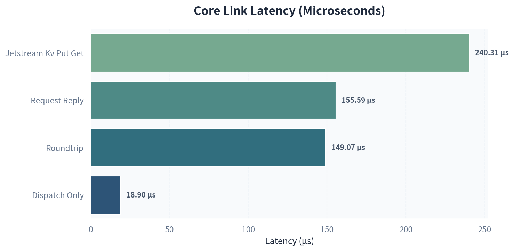
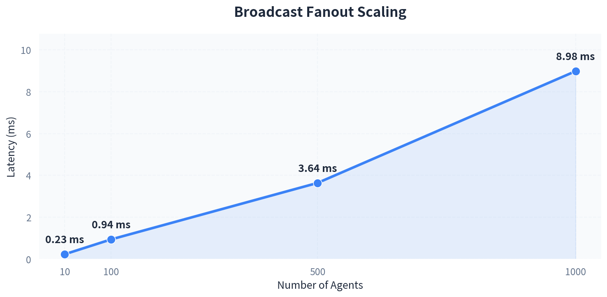
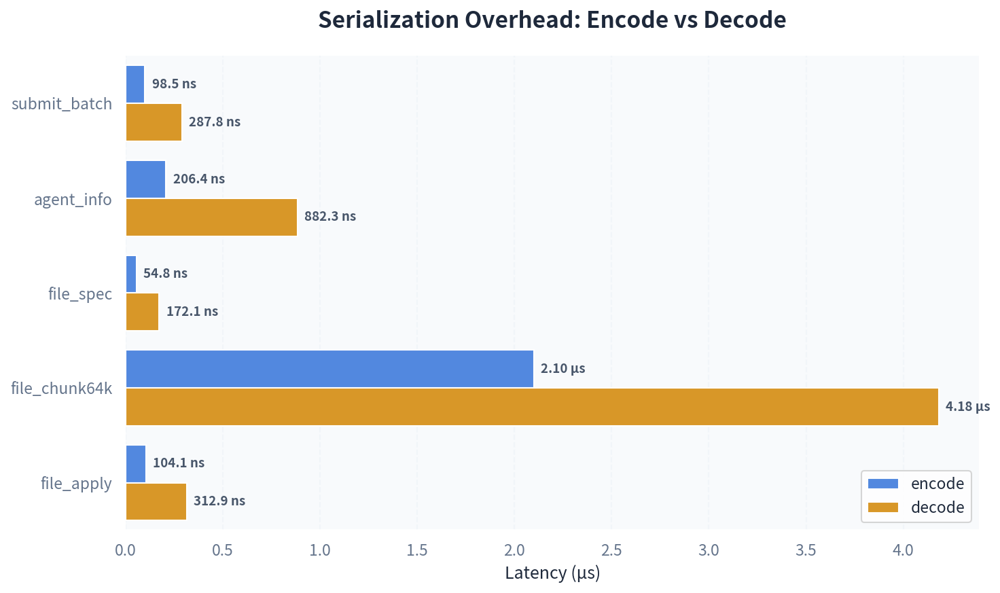
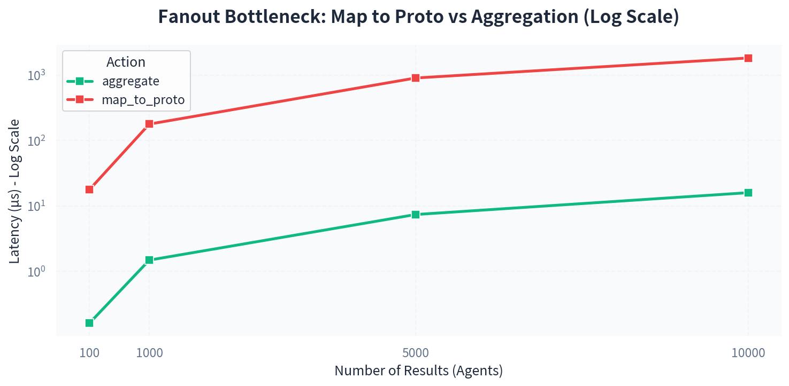
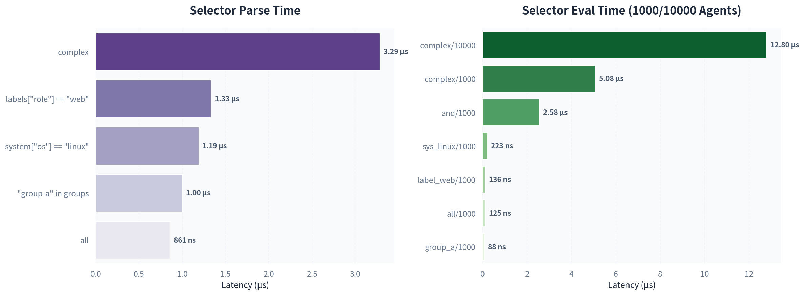
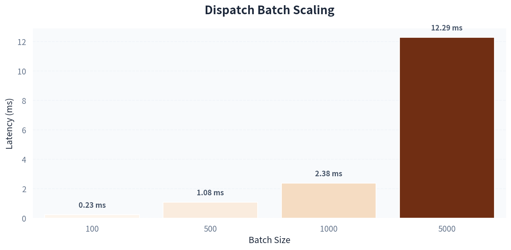

# 📊 Oasis Benchmark

> [!NOTE]
> **这份文档记录了 Oasis 在最近一次真实 NATS 环境与纯内存路径下的基准测试结果。**
> 测试覆盖了控制面单跳延迟、广播扇出、CPU 热路径以及持续吞吐量等核心指标。

## 🎯 结论速览

Oasis 的当前性能画像非常稳定，能够轻松应对高并发管控场景：

- ⚡ **超低延迟**：真实 NATS TLS 请求-响应保持在 `150 µs` 左右。端到端 roundtrip 也保持在 `150 µs`，P99.9 低于 `0.5 ms`。
- 🚀 **高效扇出**：1000 个 Agent 的广播调度窗口仅需 `8-10 ms`，延迟增长与节点规模保持线性健康比例。
- 🌊 **高吞吐量**：在持续 10 秒的压力测试下，稳定吞吐达到 `186,930 tasks/sec`。
- 🔍 **优化方向**：目前 CPU 侧的性能热点主要集中在 `fanout/map_to_proto`（结果映射），而不是状态聚合本身。

---

## 总览

| 场景 | 结果 | 说明 |
|------|------|------|
| `nats_io/request_reply` | `152.32-158.87 µs` | 真实 NATS TLS 请求-响应 |
| `e2e_latency/roundtrip` | `146.48-151.67 µs` | Server → NATS → Agent → NATS → Server |
| `e2e_latency/broadcast_to_agents/1000` | `8.02-9.95 ms` | 千节点广播链路 |
| `throughput/sustained` | `186,930 tasks/sec` | 持续 10 秒真实吞吐 |
| `fanout/map_to_proto/10000` | `1.8281 ms` | 扇出结果映射 |

---

## 关键链路



| 场景 | 结果 | 说明 |
|------|------|------|
| `nats_io/request_reply` | `152.32-158.87 µs` | 单次消息往返 |
| `nats_io/jetstream_kv_put_get` | `234.50-246.13 µs` | JetStream KV 读写 |
| `e2e_latency/dispatch_only` | `18.814-18.990 µs` | 纯派发开销 |
| `e2e_latency/roundtrip` | `146.48-151.67 µs` | 完整控制链路 |
| `e2e_latency/broadcast_to_agents/10` | `228.54-235.11 µs` | 10 个 Agent 广播 |
| `e2e_latency/broadcast_to_agents/100` | `927.10-957.14 µs` | 100 个 Agent 广播 |
| `e2e_latency/broadcast_to_agents/500` | `3.5841-3.6978 ms` | 500 个 Agent 广播 |
| `e2e_latency/broadcast_to_agents/1000` | `8.0171-9.9480 ms` | 1000 个 Agent 广播 |



---

## CPU 热路径

### 纯内存 / 序列化路径



| 场景 | 结果 | 说明 |
|------|------|------|
| `proto/submit_batch` encode | `98.5 ns` | 批量任务请求编码 |
| `proto/submit_batch` decode | `287.8 ns` | 批量任务请求解码 |
| `proto/agent_info` encode | `206.4 ns` | Agent 元数据编码 |
| `proto/agent_info` decode | `882.3 ns` | Agent 元数据解码 |
| `proto/file_spec` encode | `54.8 ns` | 文件规格编码 |
| `proto/file_spec` decode | `172.1 ns` | 文件规格解码 |
| `proto/file_chunk64k` encode | `2.100 µs` | 64 KiB 分块编码 |
| `proto/file_chunk64k` decode | `4.182 µs` | 64 KiB 分块解码 |
| `proto/file_apply` encode | `104.1 ns` | 文件应用请求编码 |
| `proto/file_apply` decode | `312.9 ns` | 文件应用请求解码 |

### Fanout 与聚合



| 场景 | 结果 | 说明 |
|------|------|------|
| `fanout/aggregate/100` | `160.46 ns` | 100 条结果聚合 |
| `fanout/aggregate/1000` | `1.4818 µs` | 1000 条结果聚合 |
| `fanout/aggregate/5000` | `7.3803 µs` | 5000 条结果聚合 |
| `fanout/aggregate/10000` | `15.934 µs` | 10000 条结果聚合 |
| `fanout/map_to_proto/100` | `17.683 µs` | 100 条结果映射 |
| `fanout/map_to_proto/1000` | `178.19 µs` | 1000 条结果映射 |
| `fanout/map_to_proto/5000` | `903.46 µs` | 5000 条结果映射 |
| `fanout/map_to_proto/10000` | `1.8281 ms` | 10000 条结果映射 |

### Selector 解析与求值



| 场景 | 结果 | 说明 |
|------|------|------|
| `selector/parse/all` | `860.9 ns` | 空表达式解析 |
| `selector/parse/labels["role"] == "web"` | `1.335 µs` | 单条件解析 |
| `selector/parse/system["os"] == "linux"` | `1.192 µs` | 系统字段解析 |
| `selector/parse/"group-a" in groups` | `1.003 µs` | 分组表达式解析 |
| `selector/parse/complex` | `3.289 µs` | 复合表达式解析 |
| `selector/eval/all/1000` | `124.8 ns` | 1000 Agent 下全量匹配 |
| `selector/eval/label_web/1000` | `135.7 ns` | 1000 Agent 下标签匹配 |
| `selector/eval/sys_linux/1000` | `223.0 ns` | 1000 Agent 下系统字段匹配 |
| `selector/eval/group_a/1000` | `88.45 ns` | 1000 Agent 下分组匹配 |
| `selector/eval/and/1000` | `2.576 µs` | 1000 Agent 下 AND 求值 |
| `selector/eval/complex/1000` | `5.08 µs` | 1000 Agent 下复杂求值 |
| `selector/eval/complex/10000` | `12.80 µs` | 10000 Agent 下复杂求值 |

---

## 真实 NATS I/O 与吞吐



| 场景 | 结果 | 说明 |
|------|------|------|
| `nats_io/request_reply` | `152.32-158.87 µs` | 真实 NATS TLS 请求-响应 |
| `nats_io/jetstream_kv_put_get` | `234.50-246.13 µs` | 真实 JetStream KV 读写 |
| `throughput/dispatch_batch/100` | `225.49-240.26 µs` | 100 条任务批量下发 |
| `throughput/dispatch_batch/500` | `1.0367-1.1195 ms` | 500 条任务批量下发 |
| `throughput/dispatch_batch/1000` | `2.1107-2.6535 ms` | 1000 条任务批量下发 |
| `throughput/dispatch_batch/5000` | `11.702-12.881 ms` | 5000 条任务批量下发 |
| `throughput/sustained` | `186,930 tasks/sec` | 10 秒持续发送/接收 |

---

## 测量方法

所有数据都来自 `criterion` 基准测试，bench 文件位于 `crates/oasis-core/benches/`。

真实 NATS 类测试需要先启动：

```bash
docker compose -f docker-compose.test.yml up -d
```

然后使用：

```bash
OASIS_BENCH_ENABLE_NATS_IO=1 \
OASIS_BENCH_NATS_URL=tls://127.0.0.1:14222 \
OASIS_BENCH_CERTS_DIR=<your_project>/certs
```

---
