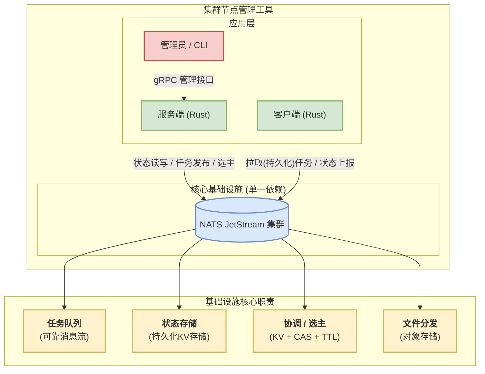
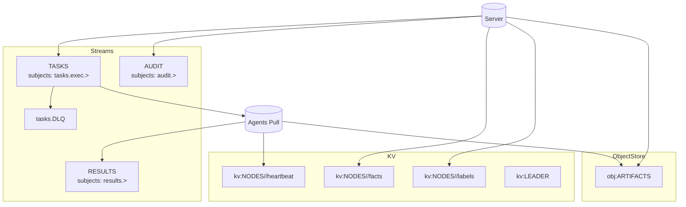
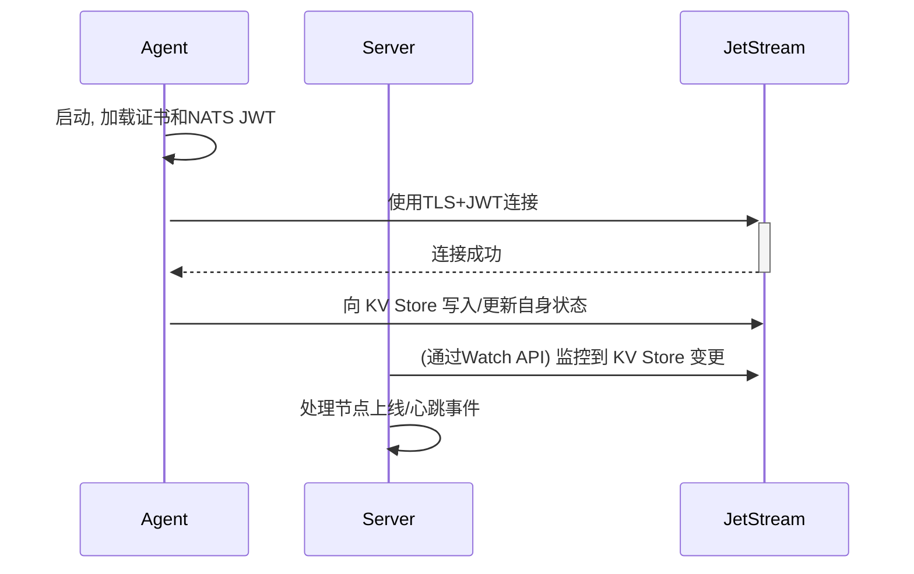
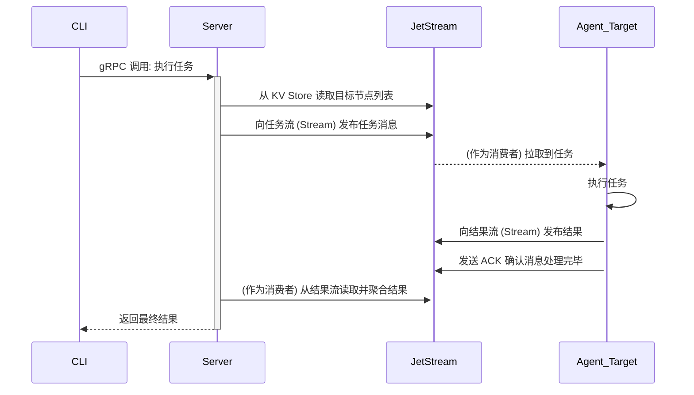
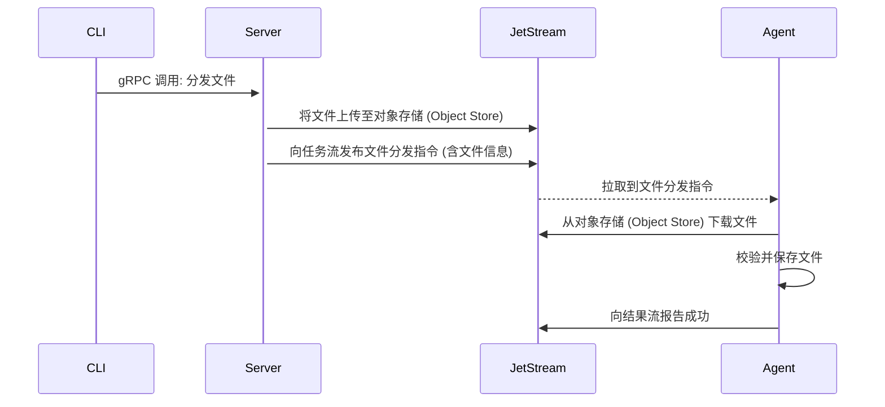

## **大规模集群节点管理工具方案设计文档**

### **1. 整体设计**

#### **1.1. 项目目标**

为 OpenCloudOS 设计并开发一款大规模集群节点管理工具。该工具旨在提供一个高性能、高可用、安全可靠的解决方案，用于对 100 至 1000+ 规模的节点集群进行高效的管理，并保证核心通信延迟在 50ms 以内。

#### **1.2. 架构原则**

- **架构统一：** 采用主从（Server/Agent）架构，并将消息、状态、协调等分布式能力收敛到单一、统一的基础设施中，以简化系统复杂度和运维成本。
- **性能优先：** 核心通信采用异步消息模型，最大化并发能力和响应速度。
- **安全可靠：** 所有通信链路均采用加密认证，关键操作需具备可靠性保证和可审计性。
- **配置统一：** 关键配置由 Server 在管理节点集中管理，作为单一事实来源，通过 KV/Object 分发至托管节点，支持审计与回滚。
- **目标选择：** 任务下发支持单播/分组/广播三种模式，基于 subject 与 durable 的组合实现路由与负载均衡。

#### **1.3. 整体架构图**



#### **1.4. 技术选型**

- **开发语言:** **Rust**。
- **核心基础设施:** **NATS JetStream**。统一提供可靠消息流、持久化键值(KV)存储、对象存储及分布式协调能力。
- **服务端 API 框架:** **gRPC (Tonic)**。作为管理员与 Server 交互的管理入口。
- **序列化:** **JSON** / **MessagePack**。

### **2. 详细设计**

#### **2.1. 状态管理与一致性**

为保证 Server 无状态和快速故障恢复，系统的所有持久化状态均由 NATS JetStream 管理。

- **节点状态与分组：** Agent 的元数据（Facts）、在线状态及分组关系等，将持久化存储于 JetStream 的 **KV Store** 中。Server 内存仅作为热数据缓存，可在重启或主节点切换后，通过 KV Store 快速重建。
- **高可用协调：** Server 集群的选主通过 **KV + CAS + TTL** 实现。约定键 `kv:LEADER`，值为 leader 实例 ID；
  - 抢占：使用 KV 条目的 Revision 做 CAS（Compare-And-Set）。
  - 租约：设置 `TTL = 2 x 心跳间隔`，Leader 周期性续租，续租失败即自动让位。
  - 观察：非 Leader 实例 watch 该键变化以进行快速切换和缓存重建。

#### **2.2. 可靠性与容错**

- **消息投递保证：** 关键业务流（如任务下发、结果上报）将使用 JetStream 的持久化消息流，并启用 **ACK (消息确认) 机制**，确保消息至少被成功处理一次 (At-Least-Once)，防止因 Agent 瞬时离线或网络抖动造成的任务丢失。
- **文件分发：** 大文件分发通过 JetStream 的 **Object Store** 实现。Server 将文件上传至 Object Store，Agent 从中拉取，避免了消息总线被大文件拥塞，同时也为文件传输提供了断点续传和校验能力。
- **幂等与去重：** Server 发布任务时设置 `Nats-Msg-Id = taskId`，Stream 开启 `duplicates` 窗口；Agent 侧持久化最近 `taskId` 与结果摘要，保障重放安全。
- **死信隔离：** 任务消费者配置 `max_deliver` 与 `ack_wait`，超过最大重试的消息路由至 `tasks.DLQ`，Server 专门消费者做告警与人工干预。
- **背压与拉取模型：** Agent 使用“拉取型 durable consumer”，通过 `pull batch/bytes`、`max_ack_pending`、`ack_wait` 控制并发与背压，避免推送风暴。
- **受限模式与降级：** JetStream 异常或网络分区时，系统进入受限模式（只读查询可用、任务下发暂停），暴露健康状态与积压告警；恢复后自动排队重放。
- **备份与灾备：** Streams/KV/Object 的备份与恢复流程规范化，定期演练，明确 RPO/RTO 目标。
- **可观测性：** 暴露发布/消费延迟、积压、重投递率、ack 超时、对象下载耗时、失败率等指标；跨组件链路使用 OpenTelemetry 跟踪（以 `taskId` 关联 trace/span）。

#### **2.3. 安全模型**

- **通信加密：** 所有组件（Server, Agent, JetStream）之间的通信均启用 **TLS** 加密。
- **身份认证与最小权限：** 每个 Agent 使用独立 **NATS JWT**，并基于账户/权限限制其可发布/订阅的 subjects（仅允许本 Agent 的任务与结果主题）。
- **凭证轮换：** 约定 mTLS 证书与 JWT 的轮换窗口与近失效告警；支持撤销与迅速失效传播。
- **操作审计与风控：** 高危操作引入二人复核；审计事件写入独立流，长周期保留。

#### **2.4. 扩展性**

- **节点分组：** 初期基于 KV Store 中的标签进行筛选；预留 **CEL (Common Expression Language)** 扩展，实现复杂动态分组。
- **任务执行器：** 可插拔设计；短期先落地“容器/命名空间隔离 + 能力限制”，长期可引入 **Wasm** 沙箱。

#### **2.5. 主题与存储设计**

- **主题命名**（示例）：

  - 任务：`tasks.exec.<group>.<agentId?>`（支持按组广播或定点单播）
  - 结果：`results.<taskId>.<agentId>`
  - 审计：`audit.<action>.<scope>`
  - 广播：`tasks.exec.broadcast`

- **Streams**：

  - `TASKS`：work-queue 语义，`replicas=3`，`storage=file`，`discard=old`，`max_age=24h`，`duplicates=2m`，配置 `max_deliver` 与 DLQ `tasks.DLQ`；subjects: `tasks.exec.>`
  - `RESULTS`：结果/审计较长保留期，便于查询与追溯；subjects: `results.>`
  - `AUDIT`：关键操作与安全事件长保留，便于合规；subjects: `audit.>`

- **KV 结构**：

  - `kv:NODES/<agentId>/facts`（版本化，非 TTL）
  - `kv:NODES/<agentId>/heartbeat`（TTL = 2 x 心跳间隔）
  - `kv:NODES/<agentId>/labels`（可由 Server/CLI 变更）

- **对象存储**：`obj:ARTIFACTS`，文件元数据包含 `sha256`、`size`、`content-type`，Agent 下载后校验。

示例（`TASKS` 配置）：

```json
{
  "name": "TASKS",
  "subjects": ["tasks.exec.>"],
  "retention": "workqueue",
  "storage": "file",
  "replicas": 3,
  "max_age": "24h",
  "duplicates": "2m",
  "discard": "old",
  "allow_direct": false
}
```

主题与存储映射（示意）：



#### **2.6. 分组与目标选择（标签/IP 选择器 + 单播/分组/广播）**

- **标签模型**：Server 在 KV 中维护每个节点的标签（如 `env`,`role`,`az` 等）与元信息（`ip`、`hostname`）。
- **选择器语法**：支持布尔表达式，操作符包含 `==,!=,in,&&,||,!`，字段包含标签键与保留键（`ip`,`hostname`）。示例：
  - `env=="prod" && role=="worker"`
  - `ip in 10.0.0.0/8 || ip in 192.168.0.0/16`
- **路由策略**：
  - 单播：`tasks.exec.agent.<agentId>`，专属 durable；适用于定向下发/诊断。
  - 分组：`tasks.exec.group.<group>`，组内共享 durable（工作队列），组内负载均衡；可将 `group` 定义为逻辑名（如 `role=worker` 的物化组）。
  - 广播：`tasks.exec.broadcast`，每个 Agent 各自 durable，全部执行。
  - 默认：`tasks.exec.default`，全体共享 durable，未指定目标时的通道。

注：CLI 的 `--selector` 将由 Server 解析为目标集合，并展开为相应 subject 的发布动作（多目标多条消息）；与 `--agent/--group/--broadcast` 可并用，最终按 union 去重。

### **3. 组件设计**

#### **3.1. Server (服务端)**

作为系统的业务逻辑编排中心，运行在管理节点，其核心职责是响应管理请求，并与 JetStream 交互；对托管节点的关键配置进行统一管理与分发。

- **gRPC 服务模块：** 暴露 API 接口，供管理员或自动化工具调用。
- **配置中心/统一配置管理：** 维护托管节点关键配置的单一事实来源（SoT），提供配置的新增/更新/下发/回滚与变更审计；基于 JetStream KV（小配置）与 Object Store（大文件）完成分发。
- **标签与分组管理：** 提供标签变更 API/CLI（如为节点设置 `env=prod`、`role=worker`），维护节点标签索引；支持按 IP/CIDR、标签表达式选择目标集合，并将目标解析为单播/分组/广播的 subject 发布策略。
- **状态管理器：** 封装对 JetStream KV Store 的读写操作，向业务层提供统一的状态访问接口。
- **任务处理器：** 接收 gRPC 请求，构建任务并发布到 JetStream 的任务流中。
- **高可用模块：** 实现基于 KV + CAS + TTL 的选主与回调逻辑，处理主备切换与缓存重建。

#### **3.2. Agent (客户端)**

作为部署在托管节点上的执行单元，其核心职责是响应任务并上报状态。

- **身份与认证模块：** 负责加载和管理自身的 TLS 证书与 NATS JWT 凭证。
- **状态上报器：** 周期性地收集节点信息（Facts），并通过更新 JetStream KV Store 中的对应键值来完成注册和心跳维持。
- **任务订阅器：** 作为持久化消费者，连接到 JetStream 集群并订阅指定的任务流。
- **任务执行器：** 解析从任务流中收到的消息，执行相应操作（如运行命令、下载文件），并将执行结果发布到结果流。
- **消费模型与并发控制：** 使用“拉取型 durable consumer”，通过 `pull batch/bytes`、`max_ack_pending`、`ack_wait` 控制并发与背压，结合本地幂等记录避免重复执行。

#### **3.3. CLI (命令行工具)**

作为管理员的交互入口，提供最小化操作能力，便于脚本化与集成。

- **功能**
  - 执行任务：`exec`
    - 目标选择：`--agent <id,id>` / `--group <g1,g2>` / `--broadcast`
    - 选择器（可选）：`--selector '<expr>'`，按标签/IP 选择目标，如 `env=="prod" && ip in 10.0.0.0/8`
    - 命令与参数：`-- <command> [args...]`
  - 文件分发：`pull-object`
    - 语法：`pull-object --agent <ids> <object> [dest] [--sha256 HEX]`
    - 行为：向对象存储（ARTIFACTS）取回对象并在 Agent 侧落盘，按需校验哈希
  - 统一配置管理
    - 上传/更新配置：`config put <name> <file> [--sha256 HEX]`
    - 获取配置：`config get <name> [-o <path>]`
    - 下发配置：`config publish <name> --selector '<expr>' [--dest <path>]`
    - 历史与回滚：`config history <name>` / `config rollback <name> --to <version>`
  - 节点标签管理
    - 设置：`node label set <agentId> key=value [key=value...]`
    - 删除：`node label del <agentId> key [key...]`
    - 查看：`node label ls <agentId>` / `node ls --selector '<expr>'`
- **配置**
  - Server 地址：`--server http://<SERVER_IP>:50051`
  - 日志：`OASIS_LOG`（级别）、`OASIS_LOG_FORMAT`（text/json）
- **输出**
  - 成功提交后打印 `task_id`；后续可扩展 `watch/取消/分页结果` 等能力

### **4. 主要流程时序图**

#### **4.1. 节点注册与状态同步**



#### **4.2. 批量任务执行**



#### **4.3. 文件分发**



### **5. 时间规划（8 月 11 日 — 9 月 10 日）**

- **总体目标**

  - 9 月 10 日提交终稿作品（代码、文档、脚本、演示材料完整）。
  - 8 月 21 日尽量实现“功能完整”的版本（端到端可演示）。

- **里程碑**

  - 8/11–8/17：架构基线与最小闭环（Server/Agent/CLI、任务流与对象存储、工作队列）。
  - 8/18–8/21：功能完整预览（单播/分组/广播、文件分发 E2E、CLI 增强、基础 E2E/Bench）。
  - 8/22–8/28：可靠性与容错（幂等、重试、DLQ、告警）、可观测性（日志/Tracing/指标）。
  - 8/29–9/04：安全与高可用（JWT/mTLS、权限、选主与故障转移）、配置与限流背压调优。
  - 9/05–9/07：性能与容量压测（参数基线）、稳定性修复。
  - 9/08–9/10：终稿定版（Review、补测、交付物整理、演示脚本完善）。

- **周计划（按迭代推进）**

  - 第 1 周（8/11–8/17）
    - 明确需求与接口，整理任务/结果/对象存储模型与主题规范。
    - 搭建最小运行骨架：Server/Agent/CLI 通路、`tasks.exec.>` 与 `results.>`、工作队列语义。
    - 引入对象存储（Object Store），完成上传/下载 API 与脚本示例。
  - 第 2 周（8/18–8/21）
    - 目标选择能力：单播/分组/广播 主题与消费者拓扑；CLI 增强（选择器、展示）。
    - 文件分发端到端：服务端上传与分发、Agent 拉取与校验，提供一键演示脚本。
    - 基础 E2E 与本地基准脚本完善，形成“功能完整”预览版。
  - 第 3 周（8/22–8/28）
    - 可靠性：幂等与去重、重试/退避、DLQ 与告警；任务取消与超时治理。
    - 可观测性：统一日志、Tracing 埋点、关键指标（发布/消费延迟、积压、重投递率）。
  - 第 4 周（8/29–9/04）
    - 安全：mTLS、JWT 与权限策略；密钥与机密管理流程。
    - 高可用：选主（KV + CAS + TTL + fencing）、故障转移；限流与背压参数调优。
  - 第 5 周（9/05–9/07）
    - 性能与容量：多维压测与参数基线；内存/CPU/IO 观测与优化。
    - Bugfix 与文档初稿：用户指南、部署与运维手册、FAQ。
  - 收尾（9/08–9/10）
    - 代码与文档 Review，补充测试，交付物整理（包含 Demo 脚本与数据）。
