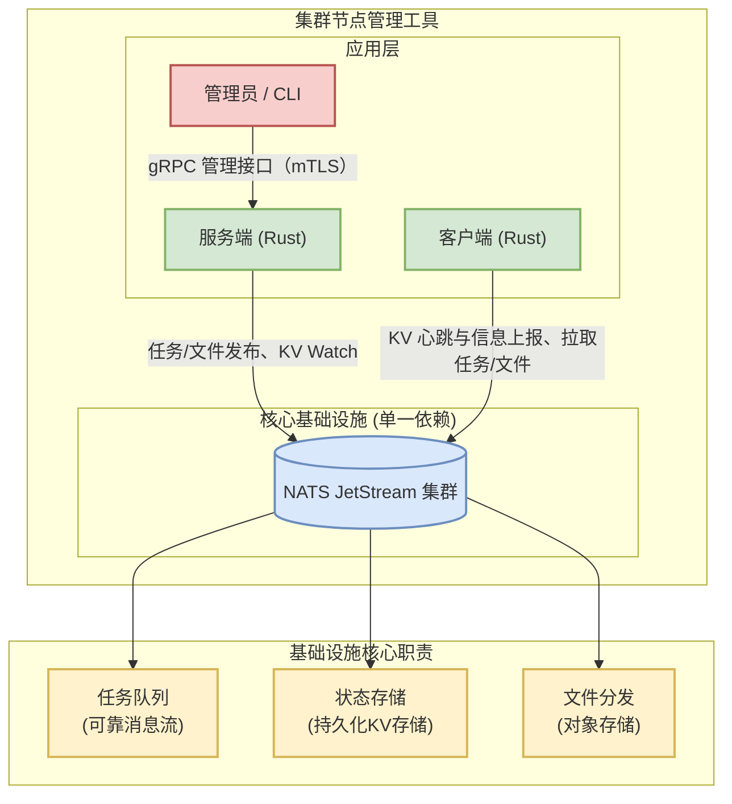
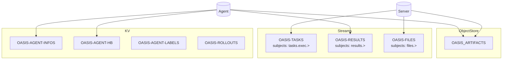
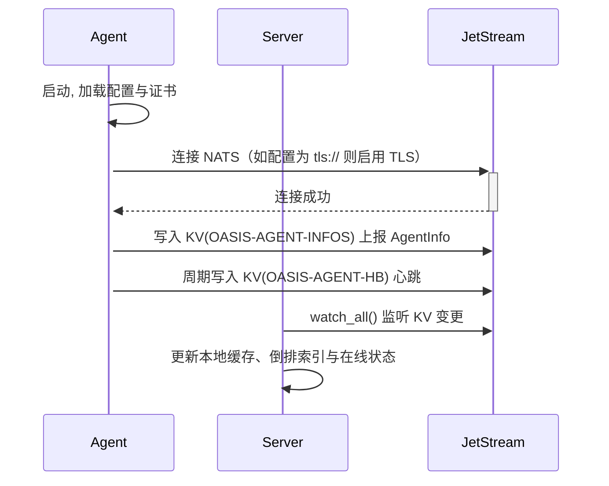
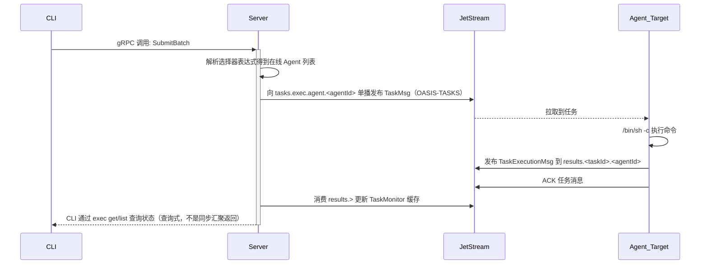
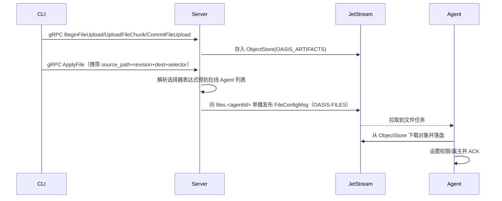

## 大规模集群节点管理工具方案设计文档

### 1. 整体设计

#### 1.1. 项目目标

为 OpenCloudOS 设计并开发一款大规模集群节点管理工具（Oasis）。该工具面向 100 至 1000+ 规模节点集群，提供统一的节点信息采集、批量命令执行、文件分发与灰度发布能力。

#### 1.2. 架构原则

- DDD 分层（Server）：服务端按职责拆分为 `interface` / `application` / `infrastructure` 三层。
  - `interface`：对外接口层（gRPC），只负责协议适配、参数校验与错误映射。
  - `application`：应用层，用例编排与流程控制（批量任务、文件分发、灰度发布等），不直接耦合具体基础设施。
  - `infrastructure`：基础设施层，封装 NATS JetStream、TLS、Streams/KV/ObjectStore 初始化与监控等细节。
- 领域模型统一：核心业务类型与消息协议复用 `oasis-core` 的统一类型（Agent/Task/File/Rollout 等），避免接口层与基础设施层各自定义“重复模型”。
- Agent/Server 架构：Server 作为控制面与编排中心，Agent 作为执行与上报单元；控制面通过 gRPC 触发用例，数据面通过 JetStream 完成任务/结果/文件流转。
- 单一基础设施依赖：消息流、KV 与对象存储统一建立在 NATS JetStream 之上，降低组件数量与运维复杂度。
- 可靠性与幂等：关键链路采用持久化消息、ACK 与去重策略，允许消息重投递但要求执行侧幂等。

#### 1.3. 整体架构图



#### 1.4. 技术选型

- 开发语言：Rust。
- 核心基础设施：NATS JetStream。统一提供持久化消息流（Streams）、KV、对象存储（Object Store）。
- 服务端 API 框架：gRPC (Tonic)。作为管理员与 Server 交互的管理入口（采用 `https://` + mTLS）。
- 序列化：Protobuf（任务、文件、Agent 信息均为 Protobuf 消息；部分 KV 内容为 JSON）。

### 2. 详细设计

#### 2.1. 状态管理与一致性

Server 的主要状态以“内存缓存 + JetStream 持久化消息/kv”为主，其中：

- AgentInfo：由 Agent 写入 JetStream KV（Protobuf 编码）。Server 通过 KV `watch_all()` 构建本地缓存与倒排索引。
- Heartbeat：由 Agent 写入 JetStream KV（字符串时间戳）。Server 通过 KV `watch_all()` 维护在线/离线视图，并周期性超时扫描。
- 任务/批次状态：当前版本主要保存在 Server 内存缓存（TaskMonitor），同时任务执行结果由 Agent 发布到 `results.>` 流，Server 消费该流以更新缓存。

- KV Buckets：
  - `OASIS-AGENT-INFOS`：Agent 信息（facts + labels + groups + system 信息）。
  - `OASIS-AGENT-HB`：心跳（TTL bucket，Server 超时逻辑也会将其视为在线/离线依据）。
  - `OASIS-AGENT-LABELS`：Agent labels（Agent 侧也支持 `oasis:labels-update` 内置任务写入；Server 侧主要以 AgentInfo 的 info map 为准）。
  - `OASIS-ROLLOUTS`：灰度发布状态。

#### 2.2. 可靠性与容错

- 任务/文件投递：使用 JetStream Streams + `AckPolicy::Explicit`。
- 去重：
  - 任务结果上报与文件下发均设置 `Nats-Msg-Id`（用于 JetStream 去重窗口）。
  - Server 侧 streams 配置了 `duplicate_window`（见 `ensure_streams` 逻辑）。
- 重试：
  - 任务 consumer 侧设置 `max_deliver` 与 `ack_wait`。
  - Server 侧对部分 NATS/KV 操作使用 backoff 重试。

#### 2.3. 安全模型

- gRPC：CLI 通过 `https://...` 访问 Server，并加载 CA + 客户端证书（mTLS）。
- NATS：推荐使用 `tls://...`，客户端会从 `certs_dir` 尝试加载 CA 与客户端证书；若证书不存在会降级为不启用 mTLS（具体行为以 `nats.url` 是否以 `tls://` 开头为准）。

#### 2.4. 扩展性

- 选择器表达式：Server 内置解析器（pest）支持逻辑表达式，后续可扩展更多操作符。
- 任务类型：当前包含“命令任务”和“文件任务”（另有 `oasis:labels-update` 内置任务）。

#### 2.5. 主题与存储设计

系统使用以下主题与 JetStream 资源命名：

- 任务下发 subject：
  - `tasks.exec.agent.<agentId>`（Server 向单个 Agent 下发任务；Agent 为此 subject 创建 durable consumer）
- 任务结果 subject：
  - `results.<taskId>.<agentId>`（Agent 上报任务执行状态/结果）
- 文件任务 subject：
  - `files.<agentId>`（Server 向单个 Agent 下发文件部署任务；Agent 创建 durable consumer）

- Streams：
  - `OASIS-TASKS`：subjects `tasks.exec.>`，WorkQueue 语义。
  - `OASIS-RESULTS`：subjects `results.>`，Limits 语义。
  - `OASIS-FILES`：subjects `files.>`，WorkQueue 语义。

- KV Buckets：
  - `OASIS-AGENT-INFOS`：key = `agent_id`（规范化为单层键），value = Protobuf `AgentInfoMsg`。
  - `OASIS-AGENT-HB`：key = `agent_id`，value = 字符串时间戳。
  - `OASIS-AGENT-LABELS`：key = `agent_id`，value = JSON（labels map）。
  - `OASIS-ROLLOUTS`：灰度发布状态。

- 对象存储：`OASIS_ARTIFACTS`。
  - 对象 key：`{path_hash}/{filename}.v{revision}`，其中 `path_hash = sha256(source_path)[0..8]`。
  - 当前版本指针：`{path_hash}/{filename}.current`，内容为 revision。

注：Streams/KV/ObjectStore 的创建与更新由 Server 启动阶段统一完成（`ensure_streams`）。

主题与存储映射（示意）：



#### 2.6. 目标选择（选择器表达式）

所有需要“选目标 Agent”的接口都使用同一套选择器表达式，并由 Server 解析。

- 基础关键字：
  - `all` / `true`：匹配全部 Agent。
  - `agent-1,agent-2,...`：逗号分隔的 Agent ID 列表。
- 标签匹配：`labels["k"] == "v"` 或 `labels['k'] == 'v'`。
- 系统信息匹配：`system["hostname"] == "xxx"`（system 键来自 Agent 上报的 `__system_...` 字段，使用时去掉前缀）。
- 分组匹配：`"group-name" in groups`（group 信息来自 AgentInfo 的 `__groups` 字段，逗号分隔）。
- 逻辑运算：支持 `and` / `or` / `not` 以及括号。

示例：

```text
all
agent-1,agent-2
labels["role"] == "web" and labels["environment"] == "prod"
system["hostname"] == "node-01" or "canary" in groups
not (labels["role"] == "db")
```

#### 2.7. 范围与限制

- 暂未提供 DLQ、全链路可观测性与跨 Server 选主能力。
- 暂未引入 NATS JWT/账号隔离与细粒度 subject 权限控制。

### 3. 组件设计

#### 3.1. Server (服务端)

作为系统的业务逻辑编排中心，运行在管理节点。其核心职责是响应管理请求，并与 JetStream 交互，完成任务/文件/灰度发布等能力。

- gRPC 服务模块：暴露 API 接口，供 CLI 调用（参见 `oasis.proto`）。
- Agent 视图（Monitor）：
  - `AgentInfoMonitor`：监听 `OASIS-AGENT-INFOS` KV 变更，维护 AgentInfo 缓存与 labels/system/groups 倒排索引。
  - `HeartbeatMonitor`：监听 `OASIS-AGENT-HB` KV 变更，维护在线/离线缓存并周期性超时扫描。
  - `SelectorEngine`：解析选择器表达式并以位图方式高效求交/并/非。
- 任务服务（TaskService + TaskMonitor）：
  - `TaskService` 负责批次创建与向 `tasks.exec.agent.<agentId>` 单播发布任务。
  - `TaskMonitor` 作为 `results.>` 的 durable consumer，更新任务执行状态缓存。
- 文件服务（FileService）：
  - 通过 gRPC 分片上传存入 `OASIS_ARTIFACTS`。
  - 下发文件部署任务到 `files.<agentId>`。
- 灰度发布（RolloutService）：
  - 状态持久化在 `OASIS-ROLLOUTS` KV。
  - 按阶段将目标解析为 Agent 子集，并复用任务/文件服务执行。

#### 3.2. Agent (客户端)

作为部署在托管节点上的执行单元，其核心职责是上报节点信息与心跳、执行任务并回传结果、接收文件部署任务并落盘。

- 信息上报：启动时写入 `OASIS-AGENT-INFOS`（包含 labels、groups、系统信息 `__system_*`）。
- 心跳：每 30 秒写入 `OASIS-AGENT-HB`（时间戳字符串）。
- 任务执行（命令）：订阅 `tasks.exec.agent.<agentId>`，收到 `TaskMsg` 后用 `/bin/sh -c` 执行并将结果（base64 输出）发布到 `results.<taskId>.<agentId>`。
- 文件部署：订阅 `files.<agentId>`，从 `OASIS_ARTIFACTS` 下载对象并写入目标路径，按需设置权限与属主。

#### 3.3. CLI (命令行工具)

作为管理员的交互入口，分为两类命令：

- 通过 gRPC 调用 Server 的业务命令（`exec` / `file` / `agent` / `rollout`）。
- 本地系统管理命令（`system`），用于初始化证书与 NATS、以及将 Server 安装为 systemd 服务。

- 功能
  - `exec`：批量命令执行
    - `oasis-cli exec run -t <selector> -- <command> [args...]`
    - `oasis-cli exec get <batch_id> [--states created,pending,...]`
    - `oasis-cli exec list --limit N [--states ...]`
    - `oasis-cli exec cancel <batch_id>`

  - `file`：文件上传/分发/历史/回滚
    - `oasis-cli file apply --src <local> --dest <remote> -t <selector> [--owner user:group] [--mode 0644] [--sha256 HEX]`
    - `oasis-cli file history --source-path <path>`
    - `oasis-cli file rollback --source-path <path> --revision <rev> --dest <remote> -t <selector> [--owner ...] [--mode ...]`
    - `oasis-cli file clear`

  - `agent`：Agent 部署/查询/移除/设置
    - `oasis-cli agent deploy --ssh-target user@host --agent-id <id> --nats-url <url> [--labels k=v]... [--groups g]... [--agent-binary ./oasis-agent] [--generate-cert] [--auto-install]`
    - `oasis-cli agent list [-t <selector>] [--verbose] [--is-online]`
    - `oasis-cli agent remove --ssh-target user@host --agent-id <id>`
    - `oasis-cli agent set --agent-id <id> [--labels k=v,k=v] [--groups group1,group2]`

  - `rollout`：灰度发布
    - `oasis-cli rollout create --name <name> -t <selector> --strategy percentage:10,30,60,100 --command <cmd> [--args ...] [--timeout S] [--auto-advance] [--advance-interval S]`
    - `oasis-cli rollout create --name <name> -t <selector> --strategy count:2,5,10,0 --file-src <local> --file-dest <remote> [--file-mode 0644] [--file-owner user:group]`
    - `oasis-cli rollout status <rollout_id>`
    - `oasis-cli rollout list --limit N [--states created,running,...]`
    - `oasis-cli rollout advance <rollout_id>`
    - `oasis-cli rollout rollback <rollout_id> [--rollback-cmd <cmd>]`

  - `system`：本地系统管理（无需 gRPC）
    - `oasis-cli system init [--output-dir DIR] [--force]`（生成证书、docker-compose）
    - `oasis-cli system install [--cfg-dir DIR] [--server-bin PATH] [--user root] [--group root]`
    - `oasis-cli system enable|start|stop|restart|status|logs|uninstall`

- 配置
  - CLI 通过 `--config <path>` 指定配置文件，默认读取当前目录 `oasis.toml`。
  - 支持 `OASIS__...` 环境变量覆盖（例如 `OASIS__NATS__URL`）。

- 输出
  - `exec run` 成功提交后打印 `batch_id`，后续通过 `exec get/list` 查询执行状态

### 4. 主要流程时序图

#### 4.1. 节点注册与状态同步



#### 4.2. 批量任务执行



#### 4.3. 文件分发



### 5. 运行与部署

#### 5.1. 配置文件

`oasis.toml` 示例：

```toml
[telemetry]
log_level = "info"
log_format = "text"
log_no_ansi = false

[nats]
url = "tls://127.0.0.1:4222"

[grpc]
url = "https://localhost:50051"

[tls]
certs_dir = "./certs"

[server]
listen_addr = "0.0.0.0:50051"
heartbeat_ttl_sec = 60
```

#### 5.2. 初始化 NATS + 证书

使用 CLI 生成运行所需文件：

```bash
oasis-cli system init --output-dir .
docker compose up -d
```

#### 5.3. 启动 Server

开发/手动运行：

```bash
oasis-server --config oasis.toml
```

或安装为 systemd 服务：

```bash
oasis-cli system install --cfg-dir .
oasis-cli system enable
oasis-cli system start
```

#### 5.4. 部署 Agent

生成部署包并安装：

```bash
oasis-cli agent deploy --ssh-target root@<host> --agent-id <id> --nats-url tls://<nats>:4222 --auto-install --agent-binary ./oasis-agent
```